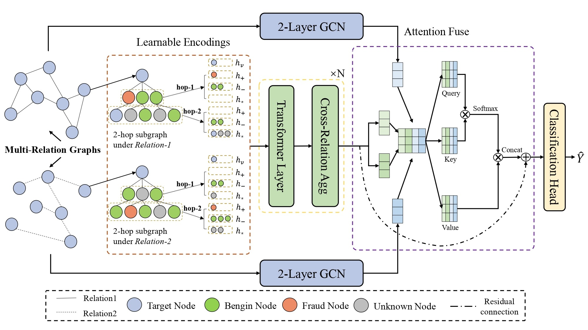

# RAGFormer
This repository contains the PyTorch implementation for our paper RAGFormer. 

[ArXiv](https://arxiv.org/abs/2402.17472)


## Overview


Fraud detection remains a challenging task due to the complex and deceptive nature of fraudulent activities. Current approaches primarily concentrate on learning only one perspective of the graph: either the topological structure of the graph or the attributes of individual nodes. However, we conduct empirical study to reveal that these two types of features, while nearly orthogonal, are each independently effective. As a result, previous methods can not fully capture the comprehensive characteristics of the fraud graph. To address this dilemma, we present a novel framework called Relation-Aware GNN with transFormer~(RAGFormer) which simultaneously embeds both semantic and topological features into a target node. The simple yet effective network consists of a semantic encoder, a topology encoder and an attention fusion module. The semantic encoder utilizes Transformer to learn semantic features and node interactions across different relations. We introduce Relation-Aware GNN as the topology encoder to learn topological features and node interactions within each relation. These two complementary features are interleaved through an attention fusion module to support prediction by both orthogonal features. Extensive experiments on two popular public datasets demonstrate that RAGFormer achieves the state-of-the-art performance. The significant improvement of RAGFormer in an industrial credit card fraud detection dataset further validates the applicability of our method in real-world business scenarios.

## Installation
To run the code, Pytorch and DGL need to be installed.  Details in `ragformer.yml` and `ragformer_requirements.txt`. All models are trained on  NVIDIA GeForce RTX 3090 GPUs. ( Our environment : python=3.8.13, pytorch=1.12.1, dgl==1.1.2+cu116)

Two public datasets YelpChi and Amazon will be downloaded automatically by DGL. Alternatively, you can download both datasets from [Github](https://github.com/YingtongDou/CARE-GNN).
Please change the raw_dir/base_dir in dataset_split.py, data_utils.py, graph2seq_mp.py and main_ragformer.py to your own path.

## Usage

1.Prepare sequence data. (The preprocessing files of YelpChi have been uploaded, you can run directly.)

   ```bash
   cd preprocessing
   
   # dataset splitting
   python dataset_split.py --dataset yelp  --save_dir seq_data --train_size 0.4 --val_size 0.1
   
   # preprocess feature sequence 
   python graph2seq_mp.py --dataset yelp --fanouts -1 -1  --save_dir seq_data --train_size 0.4 --val_size 0.1 --n_workers 8 --add_self_loop --norm_feat
   
   #change yelp to amazon to prepare the amazon dataset
   ```
2.Run `main_ragformer.py`.

   ```bash
   python main_ragformer.py --config configs/yelpchi.json --gpu 0  --log_dir logs --early_stop 150
   ```

## Citation
If you find RAGFormer useful for your research or project, please cite the following:
```
@article{li2024fraud,
  title={Fraud Detection with Binding Global and Local Relational Interaction},
  author={Li, Haolin and Jiang, Shuyang and Zhang, Lifeng and Du, Siyuan and Ye, Guangnan and Chai, Hongfeng},
  journal={arXiv preprint arXiv:2402.17472},
  year={2024}
}
```
## Acknowledgements

RAGFormer is inspired by the recent success of [GAGA](https://github.com/Orion-wyc/GAGA) and other graph-based fraud detectors (i.e. [CARE-GNN](https://github.com/YingtongDou/CARE-GNN), [PC-GNN](https://github.com/PonderLY/PC-GNN), etc.). Our code is implemented based on GAGA, we thank the authors for sharing their codes.

